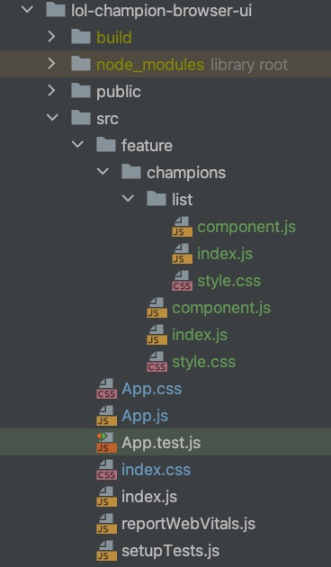
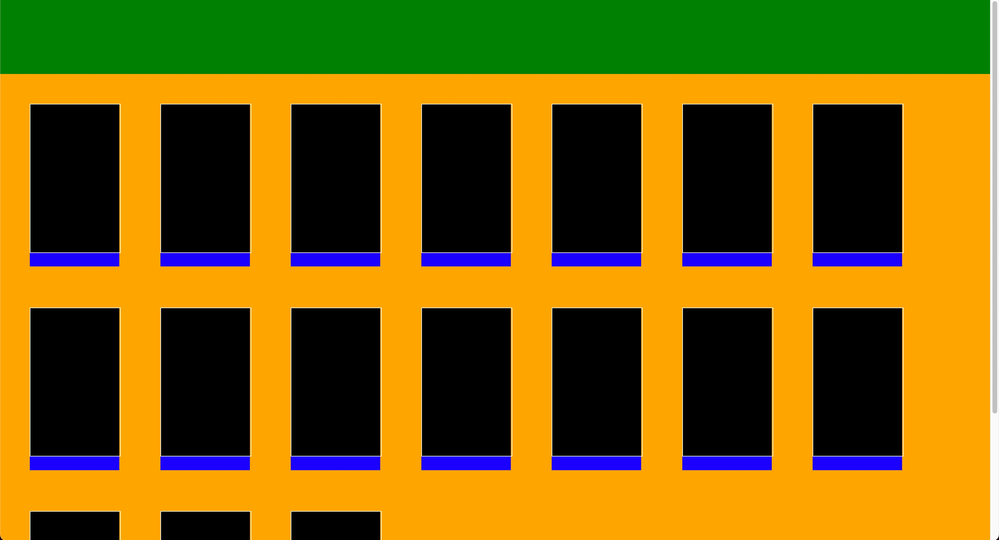

# Ekko

The Fiddlesticks branch is where we start breaking our application into rectangles:

* It's all about rectangles
* Single Page Web Applications
* Breaking our app into rectangles (elements)
* Run the application with our revised approach

## It's all about rectangles
If you step back and look at any application, you'll no doubt
notice that it's comprised of a bunch of rectangles. Some of these
rectangles contain other rectangles and some of them are content
rectangles like images or buttons or checkboxes.

Your application typically starts with one gigantic rectangle that
represents your application. We often call this rectangle the "App".
Inside the App rectangle is often multiple rectangles, each of which
represents a "page" in your "App". Inside of each "page" is a collection
of other rectangles some of which may be images or paragraphs of text
or buttons.

When one rectangle contains one or more other rectangles, this is
called a parent-child relationship. The parent rectangle is the
rectangle that contains other child rectangles.

The parent is the container. The children are the contents of the parent.
This structure repeats itself over and over in UI applications.

These rectangles in UI applications are generally known as elements.
Due to the recurring nature of UI applications consisting of elements
within elements within elements, it therefore means that any particular
element is likely both a parent element and a child element of some
parent element.

It stands to reason then that an element can contain zero or more
child elements and an element can have one and only one
parent element.

The parent-child relationship that exists between elements controls
many aspects of the way this all works. For example, if you hide an
element from display, that element and all of its child elements
and each child element of those child elements are also hidden. If 
you move an element to another location on the screen, the child
elements all move to the new location and retain their respective
positions within the parent. 

Similarly, you can apply styles to your
rectangles to change the way they look. Some styles cascade down
through the child hierarchy and some don't. For example if you set
the background color of an element that contains many child elements,
the background color does not cascade down through the children. However,
if you set the font style for an element, it does cascade down through
the children. Any particular child element can override the inherited
style properties from its parent.

This concept is core to UI programming and you can learn much
more about this by reading up on the Document Object Model or
DOM. Understanding the DOM and how web browsers parse your web
pages into a DOM will take you a long way. 
Read up on the DOM [here](https://developer.mozilla.org/en-US/docs/Web/API/Document_Object_Model/Introduction).

## Single Page Web Applications
In the early days of web application development, each page was individually
created as a separate HTML file. Whenever you wanted to show a different page,
you had to create a link to that page from the page your user is
viewing. When the user clicks the link, the browser fetches the new
page, parses it into a DOM and displays (also known as rendering) it.
This resulted in a lot of "chatter" between the browser and the
server hosting your web pages. Each time you want to display a 
different page, the browser has to fetch it, parse it and render it.

In modern web development, applications are built as SPA's (Single
Page Applications). UI frameworks like React help you construct
SPA's. Instead of having a bunch of individual HTML files hosted
on the server, you have one. Your whole web app is contained in a
single file, so the browser fetches the page once, parses it and
renders parts of it.

Don't worry, you don't have to write your whole web app in one
gigantic file. We will build our app in separate files and React
will package it up for us into a SPA.

You can read more about SPA's [here](https://developer.mozilla.org/en-US/docs/Glossary/SPA).

## Breaking our app into rectangles (elements)
To keep things very simple at first, we're only going to focus on
the champions list page and not spells or items.
We'll add space for those later. For now, let's just keep things as simple
as possible. In fact, we're not even going to add a page for viewing
the skins of champions, just the champions list.

In this branch (Fiddlesticks), we're not even going to focus on content.
We won't fetch any data from our NodeJS application. We're just going
to focus on creating the structure of our UI application and consequently,
creating our own elements. We'll do some minimal, temporary styling
using CSS just so you can see how that works. But, these are not
final styles, just temporary (and ugly).

### Structure and naming
There are countless ways to structure your React app in terms of
folders. You'll likely eventually come up with your own way or
adopt the ways of someone else.

I came across this guy's blog and read through this [article](https://www.robinwieruch.de/react-folder-structure/).
For this project, I'm going to just follow his way. So, please go ahead
and read through that article so that you'll have a better understanding
of the structure and naming used in this application.

You can see how I've structured the application in terms of folders
and naming. You can see that at the top level is `App.js` and `App.css`.
These files were generated when we created our React app.

Underneath the `src` folder, you can see I've created a `feature` folder.
Beneath that is our single feature (so far); `champions`. Underneath `champions`
is `list`, which is where our champions list component will live. Later,
we will have a peer folder to `list` called `skins`, but we'll get
to that at some other time.

For now, we just have this. Within each folder, we have a recurring
set of files named `component.js`, `index.js` and `style.css`.
Each feature component declares its UI in the `component.js` file. The
`index.js` file is how other components in our app will reference the
component and finally `style.css` contains the CSS styling for the component.

Later, when we add functionality including tests, we will add more
files to each component folder. All you need to understand at this point is
that each folder underneath `feature` represents a component. A component
is part of the user interface. Within each component folder are 3 files;
`component.js`, `index.js` and `style.css`. That structure will repeat
itself over and over throughout our app. That said, our app is not that
big, so it's not like we are going to have a lot of components.

This app eventually will consist of 3 features; champions, items and spells.
Since we're initially only focusing on champions, the champions page will
show either the list of champions shown as images or when you click
on any champion, you'll transition to the skins view where you can
scroll through the skins for that champion one skin at a time.

To be more specific and to drive this point home, we are initially focusing
building the champions list feature of the app. Inside the list, we will
have a header space where we will eventually add a component to allow us
to filter the list of champions.

### It's rectangles everywhere
I said we were initially focusing on rectangles and not content. Below is
what our app looks like at this stage. You can see nothing but rectangles.

Here is what we have. We have the App rectangle, which you can't see because
the App is comprised of child rectangles that fill the entire App rectangle.
The App rectangle currently has one child; the Champions Page which fills the
entire parent rectangle. The Champions Page currently has one child; the Champions
List which fills the entire parent rectangle. The Champions List
has two children; a header and the list itself.

Since the Champions Page is the visible (and currently only) App child, it
is visible and fills the entire space. Similarly, the Champions List component
is the visible (and currently only) Champions Page child and is visible and fills
the entire space. 

The Champions List component has two children; the Champions List Header 
(which will eventually be used for filtering) and a grid of panels, one for
each champion. These panels are the same component and is called a Champion Panel.
Finally, inside each Champion Panel is an image of the champion and a 
caption which will contain the champion name.

The Champion List Header is 100px tall (for now) and has a background color
of green. The Champion List occupies the remaining space and has a background
color of orange. Each Champion Panel has a black background, fixed height of 218px and fixed width
of 120px with no padding. Inside the Champion Panel is an image which
currently has a border color of white and is fixed at 120px by 218px. Finally,
the Champion Panel also has a caption which has a blue background.

All of this styling that I've done in the rectangles is temporary and used
to make it obvious where all the rectangles are. Eventually, you won't need
to do this when you're building UI's, but for now it's very helpful for you
to be able to see what is going on. Note also that the Champions List page is
scrollable. The bottom set of Champion Panels are clipped because the page
is longer than the screen and consequently scrollable.

With React, you not only create the rectangles, but you can name them so that
they make sense. That's why we have App, ChampionsPage, ChampionsList, Header, etc.
And, once named you can style them with CSS so that they can have sizes, positions,
colors, fonts, borders and anything else you can do with CSS.

### The Anatomy of our App
Let's dive into the specifics of our App and see how React is used to create
the rectangles and style them.

#### App.js
As you may recall, App.js was generated for us when we used create react app
to initialize our app. As you will do anytime you build a React app, you'll
use the generated structure to start, but delete almost everything and fill
it in with your own implementations of things.

Take a look at [App.js](/lol-champion-browser-ui/src/App.js) and it's quite simple.
It's been changed to simply import the ChampionsPage and render it. We're using
functional React components so each component is declared in a function. Earlier
I said we get to name each rectangle and we do so by naming and exporting the
function. `App` is the name of one rectangle, `ChampionsPage` is the name of another.

[App.css](/lol-champion-browser-ui/src/App.css) is also imported and used to 
style the App rectangle. For now, there is nothing there.

#### Champions Page
The Champions Page consumes all the space provided by its parent; App.js.
It will eventually display either the list of champions or the skins for a
specific champion.

For now, it just displays the list of champions. Look at the 
[component.js](/lol-champion-browser-ui/src/feature/champions/component.js) file
for the Champion Page and you'll see it too is quite simple. It imports the
ChampionsList component and render it. Note however that I create an array of
"champion" objects, each with only a name property that gets passed into
the ChampionsList component function as part of properties.

Properties (or props for short) are a key concept of React. Each UI component
can be passed properties which will typically have an impact on what the
component looks like or behaves like. You'll notice I created 18 placeholder champions in an
array and pass the array of champions into the ChampionsList.

[styles.css](/lol-champion-browser-ui/src/feature/champions/style.css) is
used to style the Champions Page. However, there is nothing here at the moment.

#### Champions List
This is where things get slightly more interesting. 
Look at the [component.js](/lol-champion-browser-ui/src/feature/champions/list/component.js)
and you'll see that it has a container element with a header and a list.

The component function declares that it accepts `props` and the first line
of the function extracts the array of champions out of `props`. Inside the
ChampionList component, you'll see that the code iterates over the array of 
champions using the `map` function to map a champion object to a UI component;
a ChampionPanel in this case. So, we will have one ChampionPanel for each
champion passed in through `props`.

Each ChampionPanel contains an image and a caption.

[style.css](/lol-champion-browser-ui/src/feature/champions/list/style.css) is
used to style all of these components. Take note as I'm using 
[Flexbox](https://css-tricks.com/snippets/css/a-guide-to-flexbox/) to
style things here. Take some time to understand Flexbox. You'll use it a lot.

Essentially, I'm using it in three spots. First is to layout the header and list.
The header is vertically on top of the list all within the list container. The
list contains a bunch of ChampionPanels and Flexbox is again used to layout
the panels into a grid. Finally, within each panel Flexbox is used to layout
the image so that it sits vertically above the caption.

The styling also colors each rectangle so that you can visually see the 
individual rectangles within the app. Eventually, this coloring will go away
and we will style it to look much better.

One thing to note with the ChampionPanel css is that I've specified
`cursor: pointer` to indicate that the cursor is to change to a pointer
whenever you hover over any panel.

Once you get all of this built, you can simply type `npm start` and it will
compile your new app, startup a server listening on port 3000 and open
the browser. You should see your app running with all the styled rectangles
laid out like you specified using Flexbox.

You can play around and change rectangle colors. As soon as you save your
changes, your browser will automatically refresh without having to stop
the server, rebuild, restart and revisit the page.

Note: I have also changed some code in our service app so that the response
from one of our /champions routes returns URL's for two champion images instead of one:

* squareImageURL: The full URL to the champion's square image
* loadingImageURL: The full URL to the champion's loading image

See [dataDragon.js](/lol-champion-browser-service/src/api_clients/dataDragon.js)
and [championsRoutes.js](/lol-champion-browser-service/src/routes/v1/champions/championsRoutes.js)
for details.

Specifically in dataDragon.js, I:

* Changed the name of the function at Line 49 as well as the body of the function
* Change the name of the function at Line 33 to reference the new function name

And in championRoutes.js, I:

* Changed Line 110 to destructure the imageLoadingURL property from the champion
* Changed Line 125 to include the imageLoadingURL property in the response

