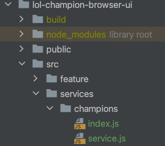
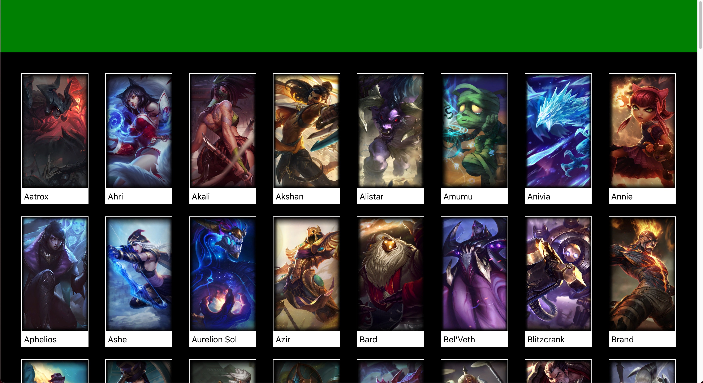
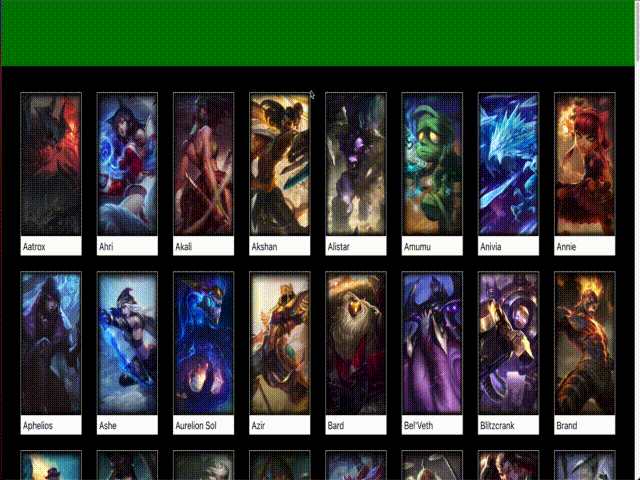

# Gwen

The Gwen branch is where we finally connect the frontend to the backend:

* Writing the React service component(s)
* Fetching data from the ChampionList

We still aren't going to be focusing on polish, so our app isn't going to
look great. I'm not a designer, so maybe it never will. But, the way we go about
this is pretty typical.

If you're lucky, you'll have a designer that you work with who provides all
the high-fidelity designs, and you can work toward that during the polish phase.
Generally, you will rough out your app in terms of components and structure and
that usually goes pretty fast. Then, you spend a lot of time polishing so that
it looks great and works great.

It's kind of like building a new home. The framing goes rather quickly. It's the
finish work that takes forever.

We're still framing, so let's fetch some data from the service we built in
the earlier branches and use it to render using real data in our app.

## Writing the React service component(s)
When we worked on the service backend, we used `fetch` to make HTTP requests
to fetch data from Data Dragon. Similarly, we will write some code in our React UI
application that uses `fetch` to fetch data from our service. The UI will know
nothing about Data Dragon. It will only talk to our service.

Following the UI folder and naming structure already created, I've added
a `services` folder, which is a peer to `feature`. Underneath are all 
the services our UI app will use. For now, we just have a `champions` service,
but eventually we'll also have a `spells` and `items` service.

As you can see, I've created an [index.js](../lol-champion-browser-ui/src/services/champions/index.js), 
which serves the same purpose as the index.js for each UI component that we've already
created. Next, we have [service.js](../lol-champion-browser-ui/src/services/champions/service.js)
which contains exported function(s) which will be used (imported) by our UI components
to interact with backend services.

If you look at the service.js `getChampion()` function, you'll see it's quite simple.
It just makes an HTTP GET request to our backend service, checks to see if we got
an error and if not, returns the response parsed as JSON. It's an async function, much
like the functions we wrote for the service and it's pretty similar.

What you might notice is that the URL that I fetch from is not a full URL, but
just the path. In other words, it's not `http://someHost:somePort/api/v1/champions`. Instead,
it's just the path portion. Why this is, is actually a pretty complex discussion, but it's key
for you to understand.

### Relative vs. absolute URL's in frontend web applications
Ultimately, all requests from one application to another must use a full URL.
That means you need the host (also sometimes referred to as the domain or origin)
and the path.

However, in frontend browser applications, you can use relative URL's (just the path and
not the host) depending upon the overall structure of your application and how it is 
deployed.

You might have noticed that our React frontend application is accessed from the
browser at http://localhost:3000. That means there is a server running on your
local machine that is listening on port 3000. But, when we were working on the
backend, our service was running behind a server also on our local machine that
is listening on port 8080. These are two different applications running on your
machine at the same time.

In a browser application, if you specify a URL that is only a path, the browser
will use the host and port that the UI application was fetched from. In our case,
that's http://localhost:3000. Therefore, the browser will use http://localhost:3000/api/v1/champions.

But wait, our backend service is accessed at http://localhost:8080, not http://localhost:3000.

Well to simplify software development, which typically occurs on your local machine
just like we're doing here, React applications have this special feature which
we can easily enable to allow the frontend server, running at http://localhost:3000
to act as something called a proxy for the backend server.

What this means is that when it receives a request to a URL it doesn't know, it
will forward that request somewhere else. If you look in our [package.json](../lol-champion-browser-ui/package.json#L5),
you'll see that I added a configuration property entitled `proxy` with the value
of `http://localhost:8080`.

This tells our frontend React server to forward any unknown requests to 
http://localhost:8080. Since the frontend React server doesn't know about
anything at path `/api/v1/champions`, it turns around and forwards that request
to our proxy, `http://localhost:8080/api/v1/champions`. That is a valid
route that our backend service serves, so we get an HTTP response from it with
a JSON payload, containing all the champions data. Remember? We implemented all
of that in a previous branch.

In the real world where we've deployed our frontend server somewhere and our
backend server somewhere, this won't work. This property only works to simplify
developing and running both on your local machine at the same time, which is very
common.

For now, I'm not going to worry about what needs to change when we actually
deploy these somewhere because we aren't going to. This app is just a simple app to help
you learn. But, know that when you're doing this for real that this approach
I'm using here won't likely work.

## Fetching data from the ChampionList
Now, that we've written our `service.js` code which interacts with our backend
API, let's use this in our ChampionsList UI component to actually fetch the
data and use it to render the list populated with real data.

First though, notice in the ChampionsPage [component.js](../lol-champion-browser-ui/src/feature/champions/component.js)
that I removed the hardcoded champions array I was previously creating and also
removed passing the array of champions in as an attribute of `props`.

I've made some fairly extensive changes to the ChampionsList [component.js](../lol-champion-browser-ui/src/feature/champions/list/component.js).
This is where I start using some of the capabilities provided by React. React has
these things called [hooks](https://reactjs.org/docs/hooks-intro.html). Make
sure you read through all the docs on hooks. You might be confused, but hopefully
seeing them in action in our simple app will help.

Read through the code comments as well as it explains the use of the useState
and useEffect hooks that I'm using.

Also, note that I lied, and I did a bit of polish. I added some animation when
you hover over any of the champions and then some reverse animation when you
move your mouse out of the champion. You can see the animations in the [style.css](../lol-champion-browser-ui/src/feature/champions/list/style.css).

Here is what our app looks like at this stage:

And here is the animation showing the style changes that occur when you
hover over a champion and how it animates back when you move your mouse
out of a champion.

## A step back
Before we move on, let's take a brief step back and take a look at how this
whole thing works.

First, we have a browser running on your local machine. When you type
`http://localhost:3000`, the browser sends an HTTP request to that host and
port. 

You also have a server running on your local machine listening on port 3000.
Since there is no path as part of the request, the server actually defaults to
`http://localhost:3000/index.html`. It does find that, which is the wrapper
around our React app and returns it.

The browser renders the HTML, which includes all the React code we wrote
and when it renders the ChampionsList component, our code makes an HTTP GET
request using only the path to `/api/v1/champions`. As previously mentioned,
the browser will automatically prepend the host and port that it fetched
the HTML from and results in an HTTP GET request to `http://localhost:3000/api/v1/champions`.
Due to the `proxy` we setup, our UI server forwards the request to `http://localhost:8080/api/v1/champions`.

This URL matches one of our service routes, and it fetches data from the Riot Games
API. After some massaging and trimming of the data inside our service, it returns an array of champions
in JSON format. This data is then used to re-render the ChampionsList.

In order to get all of this to run, you must:

1. Open a terminal window (leave it open), navigate to the `lol-champion-browser-ui` folder and run `npm start`
2. Open another terminal window (leave it open), navigate to the `lol-champion-browser-service` folder and run `npm start`

This is because you're running both servers on your local machine, and they are
independent. Each must be running in order for your full app to work. The service
can be running without the UI, but the UI cannot run without the service.
